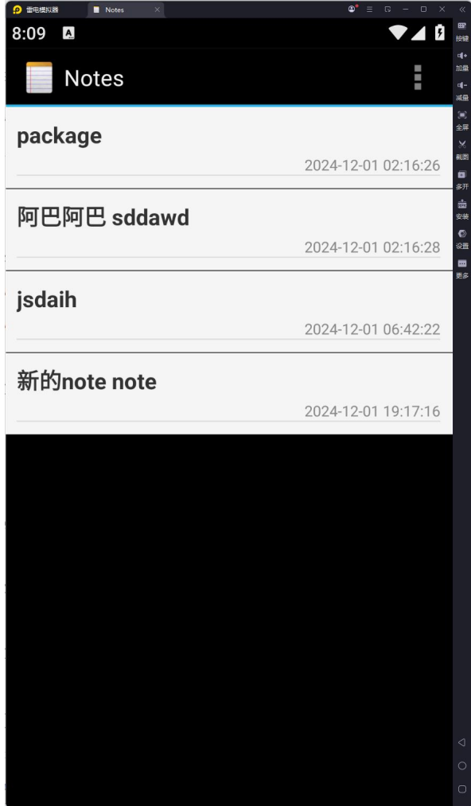
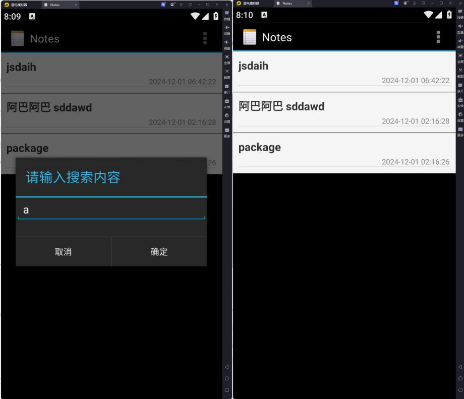
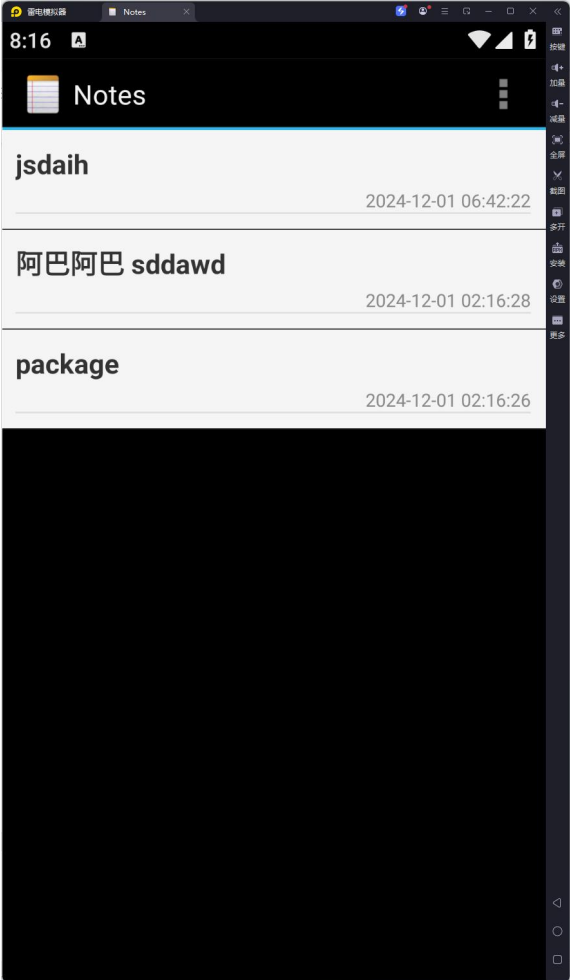
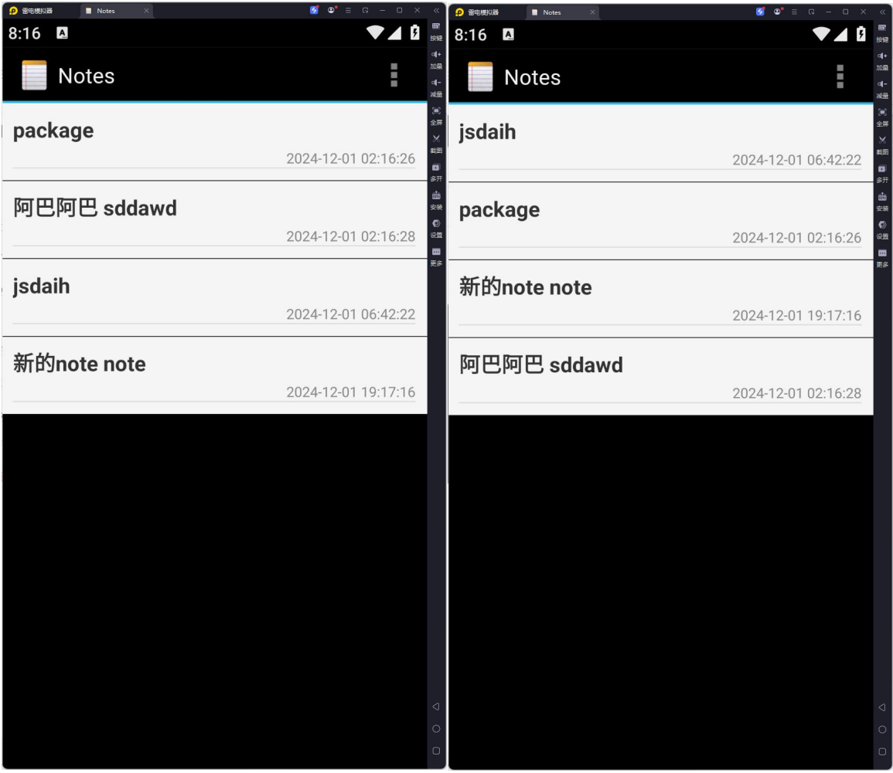

**notepad**

1. 添加时间戳 - **分析**：在笔记列表中展示时间戳，能让用户依据时间线索查找、回顾和管理笔记，便于快速定位近期编辑的笔记或查看特定时间段内容，尤其适用于笔记多、时间跨度大的情况，可提高信息检索效率。

 - **实现方式**：在 `NotesList` 类里，对查询笔记列表获取列信息的 `PROJECTION` 数组添加代表时间戳的列（如 `NotePad.Notes.COLUMN_NAME_MODIFICATION_DATE`），同时在 `SimpleCursorAdapter` 构造的 `dataColumns` 数组中添加时间戳列对应名称，在 `viewIDs` 数组里指定用于显示时间戳的界面控件 `ID`（对应显示时间戳的 `TextView` 的 `ID`），这样在数据查询绑定到列表项显示时，就能展示时间戳信息。 

- **关键代码**： `java private static final String[] PROJECTION = new String[] {    NotePad.Notes._ID,    NotePad.Notes.COLUMN_NAME_TITLE,    NotePad.Notes.COLUMN_NAME_MODIFICATION_DATE // 添加时间戳列 }; // 在 SimpleCursorAdapter 构造时 String[] dataColumns = {     NotePad.Notes.COLUMN_NAME_TITLE,     NotePad.Notes.COLUMN_NAME_MODIFICATION_DATE  }; // 添加时间戳列到这里 int[] viewIDs = { android.R.id.text1, R.id.time }; // 确保 R.id.time 对应的是用于显示时间戳的 TextView 的 ID SimpleCursorAdapter adapter = new SimpleCursorAdapter(    this,    R.layout.noteslist_item,    currentCursor,    dataColumns,    viewIDs );` 

- **实现图**：

- 2. 笔记搜索功能 

-  **分析**：随着笔记数量增多，查询功能可让用户通过输入关键词（标题或内容中的部分文字）快速筛选出想查看或编辑的笔记，无需手动逐条查找，节省时间，提升查找特定信息的便捷性。

- - **实现方式**：在 `NotesList` 类中，扩展 `performSearch` 方法里的查询条件构建逻辑，将原来仅按标题模糊匹配查询修改为构建 `OR` 条件，同时匹配标题和内容列与输入关键词的模糊匹配情况。并且在用户输入查询内容的界面（如 `startSearchActivity` 方法弹出的对话框）做好提示，告知可输入标题或内容相关关键词进行查询等交互细节优化。 

  -  **关键代码**： ```java private void performSearch() {    if (TextUtils.isEmpty(searchQuery)) {        currentCursor = getContentResolver().query(                getIntent().getData(),                PROJECTION,                null,                null,                NotePad.Notes.DEFAULT_SORT_ORDER        );    } else {        String selection = NotePad.Notes.COLUMN_NAME_TITLE + " LIKE? OR " + NotePad.Notes.COLUMN_NAME_NOTE + " LIKE?"; // 修改这里，添加对内容列的匹配        String[] selectionArgs = new String[]{"%" + searchQuery + "%", "%" + searchQuery + "%"};        currentCursor = getContentResolver().query(                getIntent().getData(),                PROJECTION,                selection,                selectionArgs,                NotePad.Notes.DEFAULT_SORT_ORDER        );    }    // 后续更新列表显示等逻辑不变，若查询结果不为空，刷新列表    if (currentCursor!= null && currentCursor.getCount() > 0) {        SimpleCursorAdapter adapter = (SimpleCursorAdapter) getListAdapter();        adapter.changeCursor(currentCursor);    } else {        Toast.makeText(this, " 未 找 到 符 合 条 件 的 note", Toast.LENGTH_SHORT).show();    } }```

  -   **实现图**：

  - - **分析**：通过颜色与主题应用以及布局与控件样式的合理设置，营造出简洁美观、舒适实用且符合操作流程直观性的界面，提升用户使用体验，方便用户查看和操作笔记内容。 

    - - **实现方式**：    - **颜色与主题应用方面**：        

      - - **整体主题设置**：通过 `<style name="AppTheme" parent="Theme.MaterialComponents.Light.NoActionBar">` 定义应用基础主题，设置 `android:windowBackground` 等属性营造不同风格的视觉效果（如亮色、暗色模式），并定义不同风格主题变体方便切换。       

        - - **控件颜色应用示例**：针对不同控件（如 Title TextView、Timestamp TextView、EditText 等）通过文本样式定义相应文本颜色、字号、字体等属性，使其视觉上主次分明、整洁统一。   

          - **布局与控件样式方面**：       

            - - **列表项布局**：利用 `ConstraintLayout` 约束机制精确排列控件位置，设置分割线增强层次感和可读性。       

              -  - **标题编辑布局**：`LinearLayout` 按垂直方向排列内部控件，对 `EditText` 设置相关属性保证标题输入合理性，并对下方按钮进行合理设置便于操作。        

              - **笔记内容编辑布局**：自定义 `LinedEditText` 类实现特殊功能并设置背景、内边距等属性，注重内容编辑舒适性和便捷性。 

              - - **关键代码**：（示例部分代码，非全部）   

                  - **整体主题设置示例**： ```xml <style name="AppTheme" parent="Theme.MaterialComponents.Light.NoActionBar">    <item name="android:windowBackground">@color/white</item> </style> <style name="AppTheme.Dark" parent="Theme.MaterialComponents.NoActionBar">    <item name="android:windowBackground">@color/black</item>    <item name="android:statusBarColor">@color/dark_gray</item> </style> ```   

                  - **控件颜色应用示例（Title TextView）**： ```xml <style name="AppTheme.TextAppearance.Title" parent="TextAppearance.MaterialComponents.Body1">    <item name="android:textColor">#333333</item>    <item name="android:textSize">18sp</item>    <item name="android:fontFamily">sans</item>    <item name="android:textStyle">bold</item> </style> ```   

                    - **列表项布局（ConstraintLayout 部分约束示例）**： ```xml <TextView    android:id="@android:id/text1"   ...    app:layout_constraintTop_toTopOf="parent"    app:layout_constraintStart_toStartOf="parent"    app:layout_constraintEnd_toEndOf="parent" /> <TextView    android:id="@+id/time"   ...    app:layout_constraintTop_toBottomOf="@android:id/text1"    app:layout_constraintEnd_toEndOf="parent" /> <View    android:layout_width="match_parent"    android:layout_height="1dp"    android:background="#DDDDDD"    app:layout_constraintTop_toBottomOf="@+id/time" /> ``` - 

                    - 实现图：

                    - 4. 笔记排序功能 

                    - **分析**：通过定义排序选项、切换逻辑以及执行排序并更新界面显示的完整流程，让用户能从不同排序角度查看笔记内容，便于信息梳理和查找。 

                    - **实现方式**：在 `NotesList` 类中，利用 `SORT_ORDERS` 数组定义可供排序的列选项，通过 `currentSortOrderIndex` 变量确定当前排序依据在数组中的索引位置，借助 `isAscendingOrder` 变量控制排序顺序，用户可通过操作界面（如菜单选项等）触发切换这两个变量的值来实现不同排序方式及顺序的调整。`performSort` 方法根据这两个变量值构建 SQL 的 `ORDER BY` 子句发起查询请求获取排序后数据，再用 `SimpleCursorAdapter` 的 `changeCursor` 方法更新列表显示。 

                      **关键代码**： ```java private static final String[] SORT_ORDERS = {NotePad.Notes.COLUMN_NAME_TITLE, NotePad.Notes.COLUMN_NAME_MODIFICATION_DATE}; private int currentSortOrderIndex = 0; // 初始化为按标题排序，索引对应 SORT_ORDERS 数组 private boolean isAscendingOrder = true; // 初始化为升序 // onCreateOptionsMenu 方法中创建排序菜单选项示例（部分代码） MenuItem sortMenuItem = menu.add("排序"); sortMenuItem.setIcon(android.R.drawable.ic_menu_sort_by_size); sortMenuItem.setOnMenuItemClickListener(new MenuItem.OnMenuItemClickListener() {    @Override    public boolean onMenuItemClick(MenuItem item) {        // 切换排序方式        currentSortOrderIndex = (currentSortOrderIndex + 1) % SORT_ORDERS.length;        performSort();        return true;    } }); private void performSort() {    String sortOrderColumn = SORT_ORDERS[currentSortOrderIndex];    String sortOrder = isAscendingOrder? sortOrderColumn + " ASC" : sortOrderColumn + " DESC";    if (TextUtils.isEmpty(searchQuery)) {        currentCursor = getContentResolver().query(                getIntent().getData(),                PROJECTION,                null,                null,                sortOrder        );    } else {        // 省略带查询条件的部分代码逻辑（与前面类似）    }    if (currentCursor!= null && currentCursor.getCount() > 0) {        SimpleCursorAdapter adapter = (SimpleCursorAdapter) getListAdapter();        adapter.changeCursor(currentCursor);    } else {        Toast.makeText(this, "未找到符合条件的 note", Toast.LENGTH_SHORT).show();    } } ``` 

                      **实现图**：
